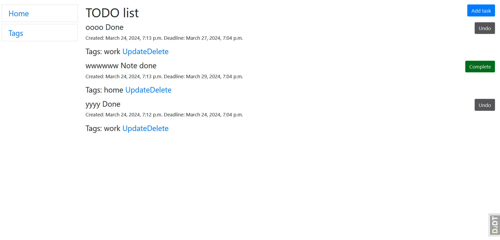
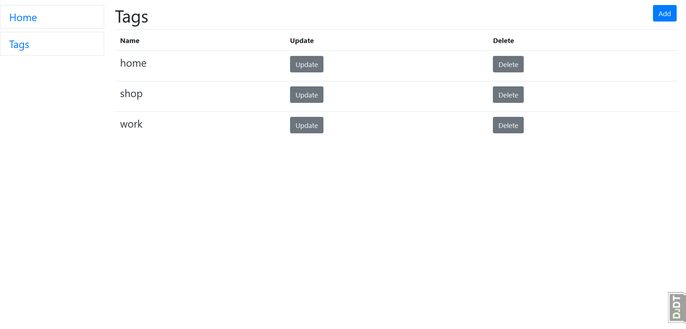

# Task service

This project has the following models:

Task - todo list is consist of tasks. Each task should have fields for:
 content - describes what you should do.
 datetime, when a task was created
 optional deadline datetime if a task should be done until some datetime
 the boolean field that marks if the task is done or not
 tags that are relevant for this task
Tag - a tag symbolizes the theme of the task and consists only of a name.

In this task you can create, edit, delete tasks. set the execution date and task execution attribute

A list of screenshots in the photo folder:

